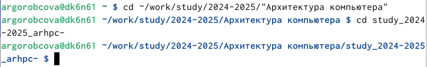
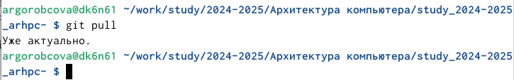
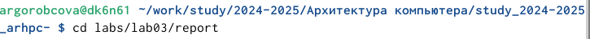
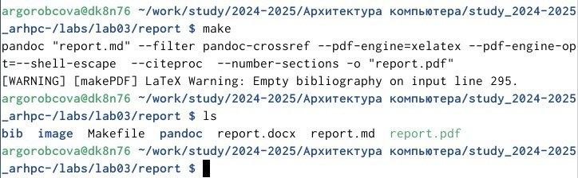
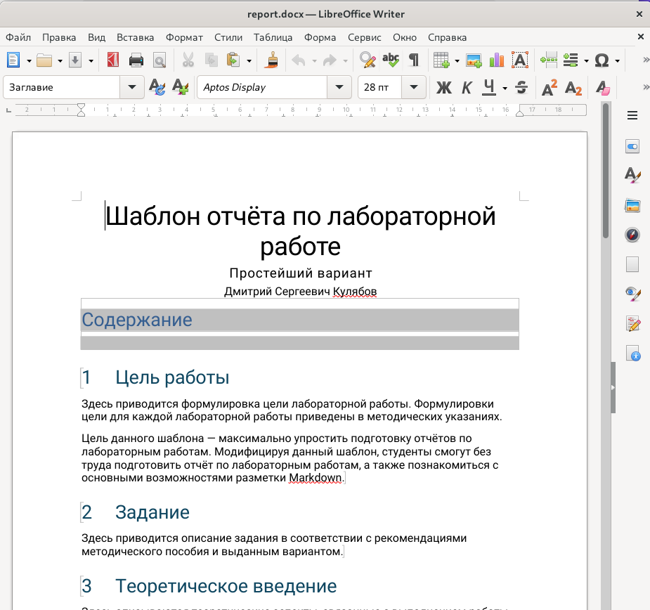
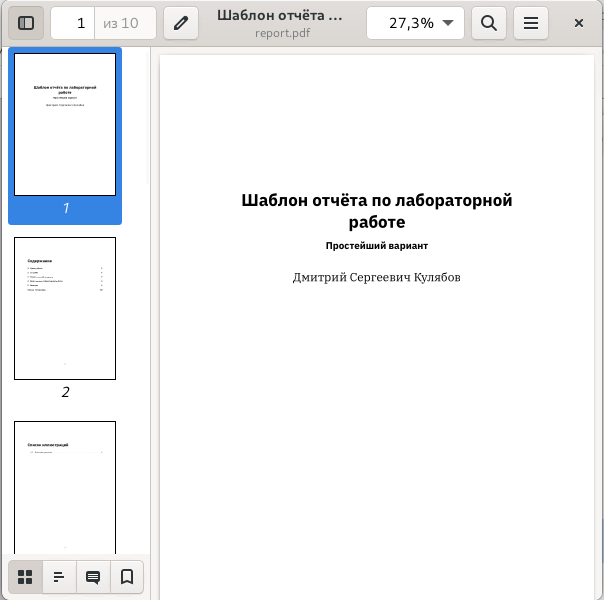
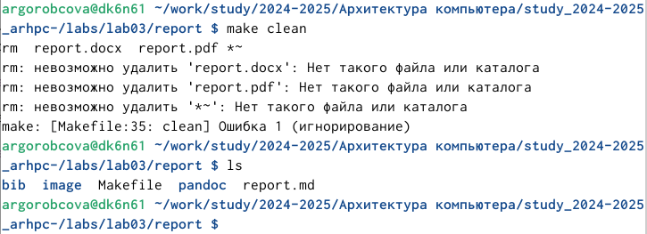
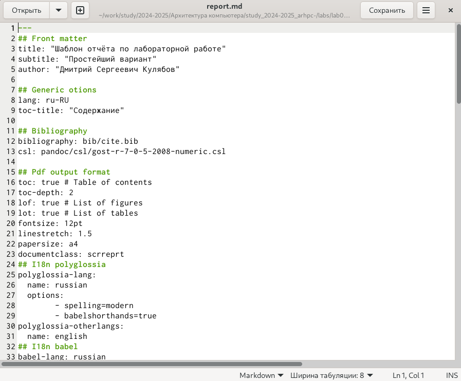
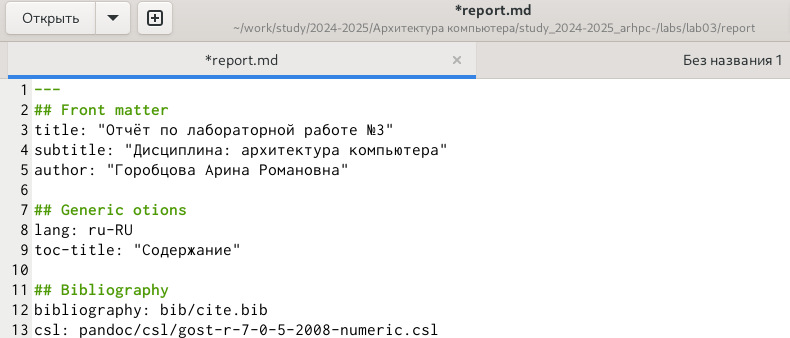

---
## Front matter
title: "Отчёт по лабораторной работе №3"
subtitle: "Дисциплина: архитектура компьютера"
author: "Горобцова Арина Романовна"

## Generic otions
lang: ru-RU
toc-title: "Содержание"

## Bibliography
bibliography: bib/cite.bib
csl: pandoc/csl/gost-r-7-0-5-2008-numeric.csl

## Pdf output format
toc: true # Table of contents
toc-depth: 2
lof: true # List of figures
lot: true # List of tables
fontsize: 12pt
linestretch: 1.5
papersize: a4
documentclass: scrreprt
## I18n polyglossia
polyglossia-lang:
  name: russian
  options:
	- spelling=modern
	- babelshorthands=true
polyglossia-otherlangs:
  name: english
## I18n babel
babel-lang: russian
babel-otherlangs: english
## Fonts
mainfont: IBM Plex Serif
romanfont: IBM Plex Serif
sansfont: IBM Plex Sans
monofont: IBM Plex Mono
mathfont: STIX Two Math
mainfontoptions: Ligatures=Common,Ligatures=TeX,Scale=0.94
romanfontoptions: Ligatures=Common,Ligatures=TeX,Scale=0.94
sansfontoptions: Ligatures=Common,Ligatures=TeX,Scale=MatchLowercase,Scale=0.94
monofontoptions: Scale=MatchLowercase,Scale=0.94,FakeStretch=0.9
mathfontoptions:
## Biblatex
biblatex: true
biblio-style: "gost-numeric"
biblatexoptions:
  - parentracker=true
  - backend=biber
  - hyperref=auto
  - language=auto
  - autolang=other*
  - citestyle=gost-numeric
## Pandoc-crossref LaTeX customization
figureTitle: "Рис."
tableTitle: "Таблица"
listingTitle: "Листинг"
lofTitle: "Список иллюстраций"
lotTitle: "Список таблиц"
lolTitle: "Листинги"
## Misc options
indent: true
header-includes:
  - \usepackage{indentfirst}
  - \usepackage{float} # keep figures where there are in the text
  - \floatplacement{figure}{H} # keep figures where there are in the text
---

# Цель работы

Целью работы является освоение процедуры оформления отчетов с помощью легковесного
языка разметки Markdown.

# Задание

1.Заполнение отчета по выполнению лабораторной работы №3 с помощью языка разметки Markdown
2.Задание для самостоятельной работы

# Теоретическое введение

Здесь описываются теоретические аспекты, связанные с выполнением работы.

Например, в табл. [-@tbl:std-dir] приведено краткое описание стандартных каталогов Unix.

: Описание некоторых каталогов файловой системы GNU Linux {#tbl:std-dir}

| Имя каталога | Описание каталога                                                                                                          |
|--------------|----------------------------------------------------------------------------------------------------------------------------|
| `/`          | Корневая директория, содержащая всю файловую                                                                               |
| `/bin `      | Основные системные утилиты, необходимые как в однопользовательском режиме, так и при обычной работе всем пользователям     |
| `/etc`       | Общесистемные конфигурационные файлы и файлы конфигурации установленных программ                                           |
| `/home`      | Содержит домашние директории пользователей, которые, в свою очередь, содержат персональные настройки и данные пользователя |
| `/media`     | Точки монтирования для сменных носителей                                                                                   |
| `/root`      | Домашняя директория пользователя  `root`                                                                                   |
| `/tmp`       | Временные файлы                                                                                                            |
| `/usr`       | Вторичная иерархия для данных пользователя                                                                                 |

Более подробно про Unix см. в [@tanenbaum_book_modern-os_ru; @robbins_book_bash_en; @zarrelli_book_mastering-bash_en; @newham_book_learning-bash_en].

# Выполнение лабораторной работы

## Заполнение отчета по выполнению лабораторной работы №3 с помощью языка разметки Markdown

Открываю терминал. Перехожу в каталог курса, сформированный при выполненнии прошлой лаборатной работы (рис. [-@fig:001]).

{ #fig:001 width=70% }

Обновляю локальный репозиторий, скачав изменения из удаленного репозитория с помощью команды git pull (рис. [-@fig:002]).

{ #fig:002 width=70% }

Перехожу в каталог с шаблоном отчета по лабораторной работе №3 с помощью cd (рис. [-@fig:003]).

{ #fig:003 width=70% }

Компилирую шаблон с использованием Makefile, вводя команду make (рис. [-@fig:004]).

{ #fig:004 width=70% }

Открываю сгенерированный файл report.docx LibreOffice (рис. [-@fig:005]).

{ #fig:005 width=70% }

Открываю сгенерированный файл report.pdf (рис. [-@fig:006]). Убедилась, что все правильно сгенерировалось.

{ #fig:006 width=70% }

Удаляю полученные файлы с использованием Makefile, вводя команду make clean (рис. [-@fig:007]). С помощью команды ls проверяю, удалились ли созданные файлы.

{ #fig:007 width=70% }

Открываю файл report.md с помощью любого текстового редактора mousepad (рис. [-@fig:008]).

{ #fig:008 width=70% }

Начинаю заполнять отчет с помощью языка разметки Markdown в скопированном файле (рис. [-@fig:009]).

{ #fig:009 width=70% }

Компилирую файл с отчетом. Загружаю отчет на GitHub.

## Задание для самостоятельной работы

Перехожу в директорию lab02/report с помощью cd, чтобы там заполнять отчет по третьей лабораторной работе (рис. [-@fig:010]).

{ #fig:010 width=70% }

Копирую файл report.md с новым именем для заполненния отчета (рис. [-@fig:011])

{ #fig:011 width=70% }

Открываю файл с помощью gedit report.md и начинаю заполнять отчет  (рис. [-@fig:012])

{ #fig:012 width=70% }

Удаляю предыдущий файл отчета, чтобы при компиляции он мне не мешал (рис. [-@fig:013]).

{ #fig:013 width=70% }

Компилирую файл с отчетом по лабораторной работе и проверяю их наличие в ls (рис. [-@fig:014]).

{ #fig:014 width=70% }

Добавляю изменения на GitHub с помощью комнадой git add и сохраняю изменения с помощью commit ([-@fig:015]).

{ #fig:015 width=70% }

Отправлялю файлы на сервер с помощью команды git pull ([-@fig:016]).

{ #fig:016 width=70% }

# Выводы

Выполнив данную лабораторную работу я обрела теоретические и пратические знания в освоение процедуры оформления отчетов с помощью легковесного языка разметки Markdown.

# Список литературы{.unnumbered}

::: {#refs}
:::
