---
## Front matter
title: "Отчёт по лабораторной работе №6"
subtitle: "Дисциплина: архитектура компьютера"
author: "Горобцова Арина Романовна"

## Generic otions
lang: ru-RU
toc-title: "Содержание"

## Bibliography
bibliography: bib/cite.bib
csl: pandoc/csl/gost-r-7-0-5-2008-numeric.csl

## Pdf output format
toc: true # Table of contents
toc-depth: 2
lof: true # List of figures
lot: true # List of tables
fontsize: 12pt
linestretch: 1.5
papersize: a4
documentclass: scrreprt
## I18n polyglossia
polyglossia-lang:
  name: russian
  options:
	- spelling=modern
	- babelshorthands=true
polyglossia-otherlangs:
  name: english
## I18n babel
babel-lang: russian
babel-otherlangs: english
## Fonts
mainfont: IBM Plex Serif
romanfont: IBM Plex Serif
sansfont: IBM Plex Sans
monofont: IBM Plex Mono
mathfont: STIX Two Math
mainfontoptions: Ligatures=Common,Ligatures=TeX,Scale=0.94
romanfontoptions: Ligatures=Common,Ligatures=TeX,Scale=0.94
sansfontoptions: Ligatures=Common,Ligatures=TeX,Scale=MatchLowercase,Scale=0.94
monofontoptions: Scale=MatchLowercase,Scale=0.94,FakeStretch=0.9
mathfontoptions:
## Biblatex
biblatex: true
biblio-style: "gost-numeric"
biblatexoptions:
  - parentracker=true
  - backend=biber
  - hyperref=auto
  - language=auto
  - autolang=other*
  - citestyle=gost-numeric
## Pandoc-crossref LaTeX customization
figureTitle: "Рис."
tableTitle: "Таблица"
listingTitle: "Листинг"
lofTitle: "Список иллюстраций"
lotTitle: "Список таблиц"
lolTitle: "Листинги"
## Misc options
indent: true
header-includes:
  - \usepackage{indentfirst}
  - \usepackage{float} # keep figures where there are in the text
  - \floatplacement{figure}{H} # keep figures where there are in the text
---

# Цель работы

Цель данной лабораторной работы - освоение арифметческих инструкций языка ассемблера NASM.

# Задание

1. Символьные и численные данные в NASM

2. Выполнение арифметических операций в NASM
    
3. Выполнение заданий для самостоятельной работы

# Выполнение лабораторной работы

## Символьные и численные данные в NASM

С помощью утилиты mkdir создаю директорию, в которой буду создавать файлы с программами для лабораторной работы №6. Перехожу в созданный каталог с помощью утилиты cd и создаю файл touch lab6-1.asm

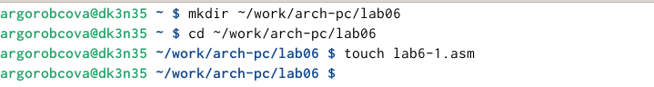{#fig:001 width=70%}

Открываю созданный файл lab6-1.asm, вставляю в него программу вывода значения регистра eax (рис. [-@fig:002]).

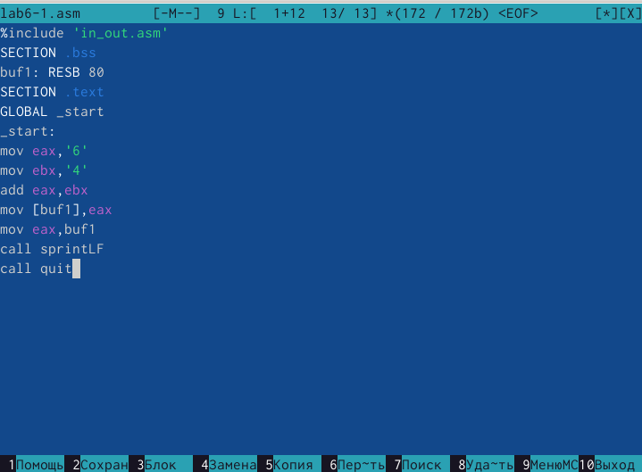{#fig:002 width=70%}

Создаю исполняемый файл программы и запускаю его. Вывод программы: символ j, потому что программа вывела символ, соответствующий по системе ASCII сумме двоичных кодов символов 4 и 6 (рис. [-@fig:003]).

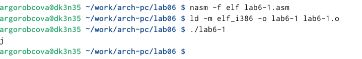{#fig:003 width=70%}

Изменяю в тексте программы символы “6” и “4” на цифры 6 и 4 (рис. [-@fig:004]).

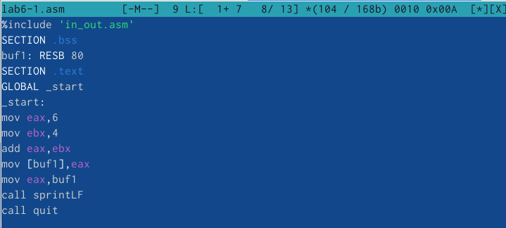{#fig:004 width=70%}

Создаю новый исполняемый файл программы и запускаю его. Теперь вывелся символ с кодом 10, это символ перевода строки, этот символ не отображается при выводе на экран (рис. [-@fig:005]). 

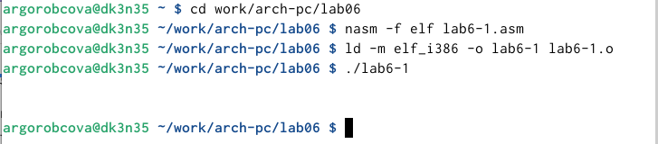{#fig:005 width=70%}

Создаю новый файл lab6-2.asm с помощью утилиты touch  (рис. [-@fig:006]). 

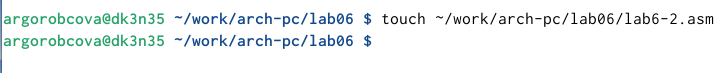{#fig:006 width=70%}

С помощью функциональной клавиши F3 открываю файл для просмотра, чтобы проверить, содержит ли файл текст программы (рис. [-@fig:007]). 

{#fig:007 width=70%}

Ввожу в файл текст другойпрограммы для вывода значения регистра eax (рис. [-@fig:008]). 

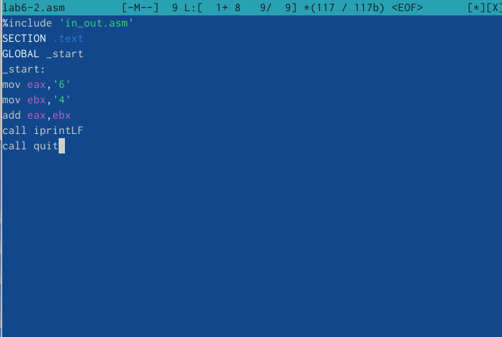{#fig:008 width=70%}

Создаю и запускаю исполняемый файл lab6-2. Теперь вывод число 106, потому что программа позволяет вывести именно число, а не символ, хотя все еще происходит именно сложение кодов символов “6” и “4”. (рис. [-@fig:009]).

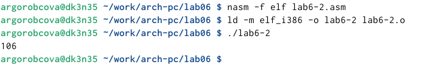{#fig:009 width=70%}

Заменяю в тексте программы в файле lab6-2.asm символы “6” и “4” на числа 6 и 4  (рис. [-@fig:010]).

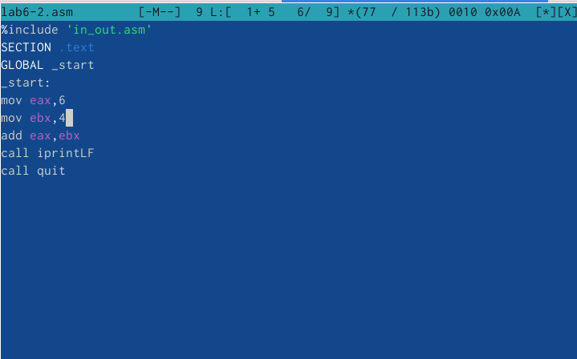{#fig:010 width=70%}

Создаю и запускаю новый исполняемый файл. Теперь программа складывает не соответствующие символам коды в системе ASCII, а сами числа, поэтому вывод 10. (рис. [-@fig:011]).

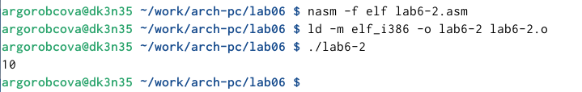{#fig:011 width=70%}

Заменяю в тексте программы функцию iprintLF на iprint  (рис. [-@fig:012]).

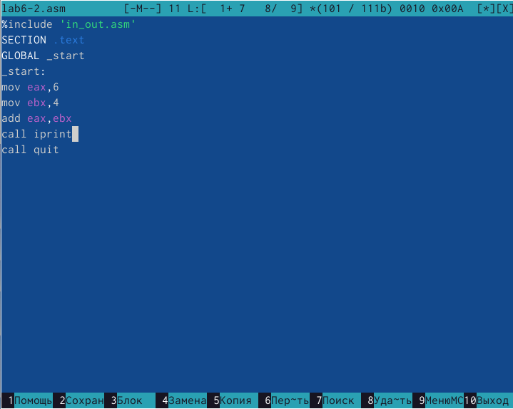{#fig:012 width=70%}

Создаю и запускаю новый исполняемый файл. Вывод не изменился, потому что символ переноса строки не отображался, когда программа исполнялась с функцией iprintLF, а iprint не добавляет к выводу символ переноса строки, в отличие от iprintLF. (рис. [-@fig:013]).

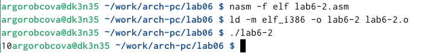{#fig:013 width=70%}

## Выполнение арифметических операций в NASM

Создаю файл lab6-3.asm с помощью утилиты touch  (рис. [-@fig:014]).

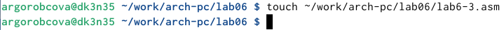{#fig:014 width=70%}

Ввожу в созданный файл текст программы для вычисления значения выражения f(x) = (5 * 2 + 3)/3 (рис. [-@fig:015]).

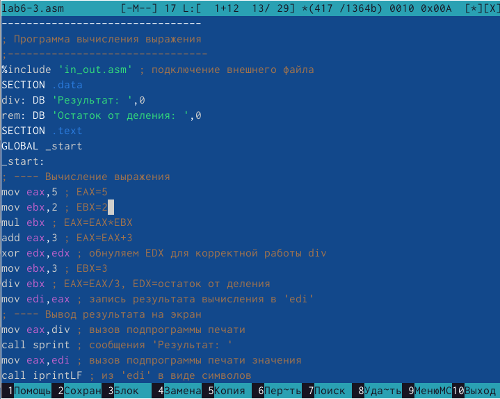{#fig:015 width=70%}

Создаю исполняемый файл и запускаю его (рис. [-@fig:016]).

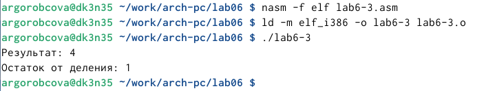{#fig:016 width=70%}

Изменяю программу так, чтобы она вычисляла значение выражения f(x) = (4 * 6 + 2)/5  (рис. [-@fig:017]).

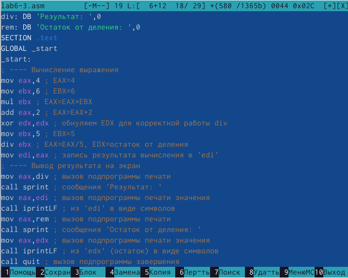{#fig:017 width=70%}

Создаю и запускаю новый исполняемый файл. Я посчитала для проверки правильности работы программы значение выражения самостоятельно, программа отработала верно (рис. [-@fig:018]). 

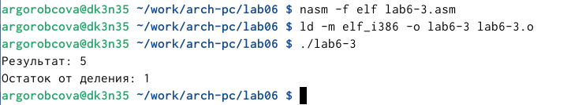{#fig:018 width=70%}

Создаю файл variant.asm с помощью утилиты touch  (рис. [-@fig:019]). 

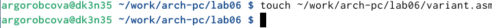{#fig:019 width=70%}

Ввожу в файл текст программы для вычисления варианта задания по номеру студенческого билета (рис. [-@fig:020]).

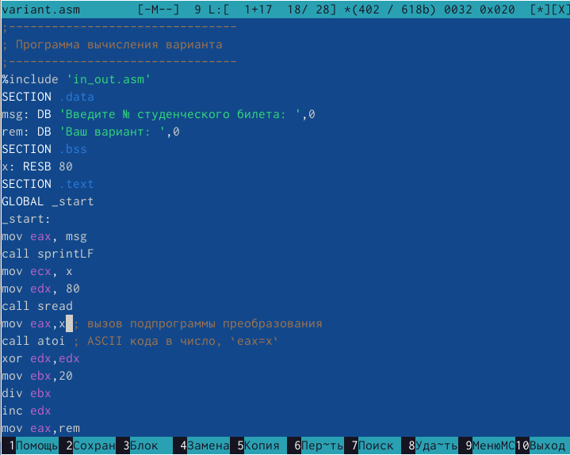{#fig:020 width=70%}

Создаю и запускаю исполняемый файл. Ввожу номер своего студ. билета с клавиатуры, программа вывела, что мой вариант - 20. (рис. [-@fig:021]).

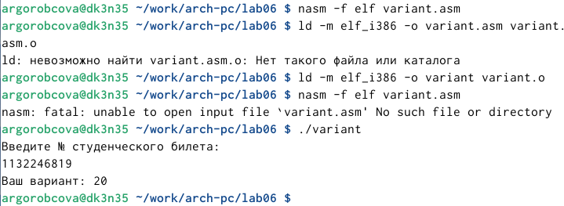{#fig:021 width=70%}

## Ответы на вопросы по программе

    1. За вывод сообщения “Ваш вариант” отвечают строки кода:
    
mov eax,rem

call sprint

    2. Инструкция mov ecx, x используется, чтобы положить адрес вводимой строки x в регистр ecx mov edx, 80 - запись в регистр edx длины вводимой строки call sread - вызов подпрограммы из внешнего файла, обеспечивающей ввод сообщения с клавиатуры
    
    3. call atoi используется для вызова подпрограммы из внешнего файла, которая преобразует ascii-код символа в целое число и записывает результат в регистр eax
    
    4. За вычисления варианта отвечают строки:
    
xor edx,edx ; обнуление edx для корректной работы div

mov ebx,20 ; ebx = 20

div ebx ; eax = eax/20, edx - остаток от деления

inc edx ; edx = edx + 1

    5. При выполнении инструкции div ebx остаток от деления записывается в регистр edx
    
    6. Инструкция inc edx увеличивает значение регистра edx на 1
    
    7. За вывод на экран результатов вычислений отвечают строки:
    
mov eax,edx

call iprintLF

## Выполнение заданий для самостоятельной работы

Создаю файл lab6-4.asm с помощью утилиты touch (рис. [-@fig:022]).

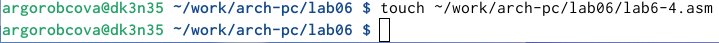{#fig:022 width=70%}

Открываю созданный файл для редактирования, ввожу в него текст программы для вычисления значения выражения x^3*1/3+21. Это выражение было под вариантом 20. (рис. [-@fig:023]). 

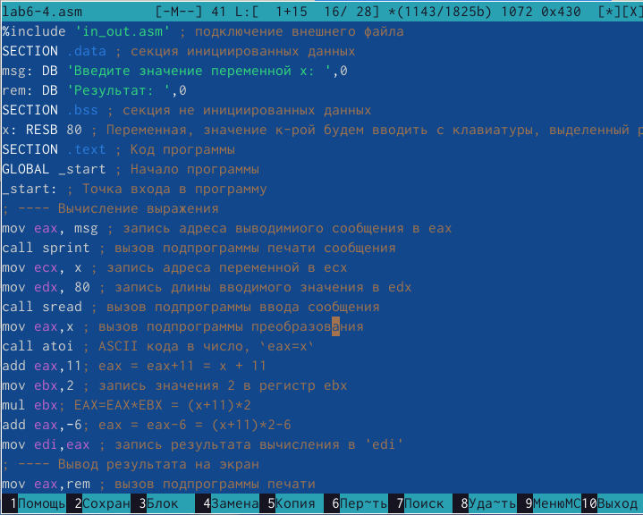{#fig:023 width=70%}

Создаю и запускаю исполняемый файл. При вводе значения 21, вывод - 48.  (рис. [-@fig:024]). 

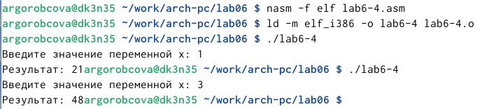{#fig:024 width=70%}

Листинг 4.1. Программа для вычисления значения выражения (11 + x) * 2 − 6.

%include 'in_out.asm' ; подключение внешнего файла

SECTION .data ; секция инициированных данных

msg: DB 'Введите значение переменной х: ',0

rem: DB 'Результат: ',0

SECTION .bss ; секция не инициированных данных

x: RESB 80 ; Переменная, значение к-рой будем вводить с клавиатуры, выделенный размер - 80 байт

SECTION .text ; Код программы

GLOBAL _start ; Начало программы

_start: ; Точка входа в программу

; ---- Вычисление выражения

mov eax, msg ; запись адреса выводимиого сообщения в eax

call sprint ; вызов подпрограммы печати сообщения

mov ecx, x ; запись адреса переменной в ecx

mov edx, 80 ; запись длины вводимого значения в edx

call sread ; вызов подпрограммы ввода сообщения

mov eax,x ; вызов подпрограммы преобразования

call atoi ; ASCII кода в число, `eax=x`

add eax,11; eax = eax+11 = x + 11

mov ebx,2 ; запись значения 2 в регистр ebx

mul ebx; EAX=EAX*EBX = (x+11)*2

add eax,-6; eax = eax-6 = (x+11)*2-6

mov edi,eax ; запись результата вычисления в 'edi'

; ---- Вывод результата на экран

mov eax,rem ; вызов подпрограммы печати

call sprint ; сообщения 'Результат: '

mov eax,edi ; вызов подпрограммы печати значения

call iprint ; из 'edi' в виде символов

call quit ; вызов подпрограммы завершения

# Выводы

При выполнении данной лабораторной работы я освоила арифметические инструкции языка ассемблера NASM.
