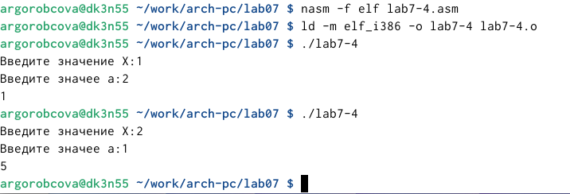

---
## Front matter
title: "Отчёт по лабораторной работе №7"
subtitle: "Дисциплина: архитектура компьютера"
author: "Горобцова Арина Романовна"

## Generic otions
lang: ru-RU
toc-title: "Содержание"

## Bibliography
bibliography: bib/cite.bib
csl: pandoc/csl/gost-r-7-0-5-2008-numeric.csl

## Pdf output format
toc: true # Table of contents
toc-depth: 2
lof: true # List of figures
lot: true # List of tables
fontsize: 12pt
linestretch: 1.5
papersize: a4
documentclass: scrreprt
## I18n polyglossia
polyglossia-lang:
  name: russian
  options:
	- spelling=modern
	- babelshorthands=true
polyglossia-otherlangs:
  name: english
## I18n babel
babel-lang: russian
babel-otherlangs: english
## Fonts
mainfont: IBM Plex Serif
romanfont: IBM Plex Serif
sansfont: IBM Plex Sans
monofont: IBM Plex Mono
mathfont: STIX Two Math
mainfontoptions: Ligatures=Common,Ligatures=TeX,Scale=0.94
romanfontoptions: Ligatures=Common,Ligatures=TeX,Scale=0.94
sansfontoptions: Ligatures=Common,Ligatures=TeX,Scale=MatchLowercase,Scale=0.94
monofontoptions: Scale=MatchLowercase,Scale=0.94,FakeStretch=0.9
mathfontoptions:
## Biblatex
biblatex: true
biblio-style: "gost-numeric"
biblatexoptions:
  - parentracker=true
  - backend=biber
  - hyperref=auto
  - language=auto
  - autolang=other*
  - citestyle=gost-numeric
## Pandoc-crossref LaTeX customization
figureTitle: "Рис."
tableTitle: "Таблица"
listingTitle: "Листинг"
lofTitle: "Список иллюстраций"
lotTitle: "Список таблиц"
lolTitle: "Листинги"
## Misc options
indent: true
header-includes:
  - \usepackage{indentfirst}
  - \usepackage{float} # keep figures where there are in the text
  - \floatplacement{figure}{H} # keep figures where there are in the text
---

# Цель работы

Изученить команды условного и безусловного переходов. Приобрести навыки написания
программ с использованием переходов. Ознакомиться с назначением и структурой файла
листинга.

# Задание

1. Реализация переходов в NASM

2. Структурирование файла листинга

3. Задание для самостоятельной работы

# Выполнение лабораторной работы

1. Реализация переходов в NASM

Создаем каталог для программам лабораторной работы № 7, переходим в него и со-
здаем файл lab7-1.asm (рис. [-@fig:001]).

{#fig:001 width=70%}

Вводим в файл lab7-1.asm текст программы из листинга (рис. [-@fig:002]).

{#fig:002 width=70%}

Создаем исполняемый файл и запускаем его (рис. [-@fig:003]).

{#fig:003 width=70%}

Изменяем программу таким образом, чтобы она выводила сначала ‘Сообщение № 2’, потом ‘Сообщение
№ 1’ и завершала работу. (рис. [-@fig:004]).

{#fig:004 width=70%}

Создаем исполняемый файл и запускаем его (рис. [-@fig:005]).

{#fig:005 width=70%}

Изменяем текст программы, чтобы вывод программы был сначала 'Сообщение №3', потом 'Сообщение №2' и 'Сообщение №1' (рис. [-@fig:006]).

{#fig:006 width=70%}

Создаем файл lab7-2.asm в каталоге ~/work/arch-pc/lab07 и вводи текст программы (рис. [-@fig:007]).

{#fig:007 width=70%}

Создаем исполняемый файл и проверяем его работу для разных значений B (рис. [-@fig:008]).

{#fig:008 width=70%}

2. Структурирование файла листинга

Создайте файл листинга для программы из файла lab7-2.asm и открываем его с помощью команды mcedit (рис. [-@fig:009]).

{#fig:009 width=70%}

Объясним содержимое трёх строк файла листинга по выбору (рис. [-@fig:010]). В строке 9 содержится собственно номер сторки [9], адресс [00000003], машинный код [803800] и содержимое строки кода [стр byte [eax], 0] в строке 11 содержится номер сторки [11], адресс [00000008], машинный код [40] и содержимое строки кода [inc eax] в строке 24 содержится номер сторки [24], адресс [0000000F], машинный код [52] и содержимое строки кода [push edx].

{#fig:010 width=70%}

Если в коде появляется ошибка, то ее описание появится в файле листинга (рис. [-@fig:011]).

{#fig:011 width=70%}

3. Задание для самостоятельной работы

Программа нахождения наименьшей из 3 целочисленных переменных a,b.
Значения переменных 20 варината, полученного при выполнении лабораторной работы № 6. (рис. [-@fig:012]).

{#fig:012 width=70%}

Создаем исполняемый файл и проверяем его работу (рис. [-@fig:013]).

{#fig:013 width=70%}

Программа, которая для введенных с клавиатуры значений x и a вычисляет
значение заданной функции f(x) и выводит результат вычислений. Вид функции 20 варианта, полученный
при выполнении лабораторной работы № 6 (рис. [-@fig:014]).

{#fig:014 width=70%}

Создаем исполняемый файл и проверяем его работу для значений x и a из таблицы (рис. [-@fig:015]).

{#fig:015 width=70%}

# Выводы

Изучили команды условного и безусловного переходов. Приобрели навыки написания
программ с использованием переходов. Ознакомились с назначением и структурой файла
листинга.

