---
## Front matter
title: "Отчёт по лабораторной работе №8"
subtitle: "Дисциплина: архитектура компьютера"
author: "Горобцова Арина Романовна"

## Generic otions
lang: ru-RU
toc-title: "Содержание"

## Bibliography
bibliography: bib/cite.bib
csl: pandoc/csl/gost-r-7-0-5-2008-numeric.csl

## Pdf output format
toc: true # Table of contents
toc-depth: 2
lof: true # List of figures
lot: true # List of tables
fontsize: 12pt
linestretch: 1.5
papersize: a4
documentclass: scrreprt
## I18n polyglossia
polyglossia-lang:
  name: russian
  options:
	- spelling=modern
	- babelshorthands=true
polyglossia-otherlangs:
  name: english
## I18n babel
babel-lang: russian
babel-otherlangs: english
## Fonts
mainfont: IBM Plex Serif
romanfont: IBM Plex Serif
sansfont: IBM Plex Sans
monofont: IBM Plex Mono
mathfont: STIX Two Math
mainfontoptions: Ligatures=Common,Ligatures=TeX,Scale=0.94
romanfontoptions: Ligatures=Common,Ligatures=TeX,Scale=0.94
sansfontoptions: Ligatures=Common,Ligatures=TeX,Scale=MatchLowercase,Scale=0.94
monofontoptions: Scale=MatchLowercase,Scale=0.94,FakeStretch=0.9
mathfontoptions:
## Biblatex
biblatex: true
biblio-style: "gost-numeric"
biblatexoptions:
  - parentracker=true
  - backend=biber
  - hyperref=auto
  - language=auto
  - autolang=other*
  - citestyle=gost-numeric
## Pandoc-crossref LaTeX customization
figureTitle: "Рис."
tableTitle: "Таблица"
listingTitle: "Листинг"
lofTitle: "Список иллюстраций"
lotTitle: "Список таблиц"
lolTitle: "Листинги"
## Misc options
indent: true
header-includes:
  - \usepackage{indentfirst}
  - \usepackage{float} # keep figures where there are in the text
  - \floatplacement{figure}{H} # keep figures where there are in the text
---

# Цель работы

Целью работы является приобретение навыков написания программ с использованием циклов и обработкой аргументов командной строки.

# Задание

1. Реализация циклов в NASM

2. Обработка аргументов командной строки

3. Задание для самостоятельной работы

# Выполнение лабораторной работы

1. Реализация циклов в NASM

Создали каталог для программам лабораторной работы № 8, переходим в него и создаем файл lab8-1.asm

Написали в файл lab8-1.asm текст программы из листинга 8.1. (рис. [-@fig:001]).
Создал исполняемый файл и проверил его работу. (рис. [-@fig:002]).

{ #fig:001 width=70%, height=70% }

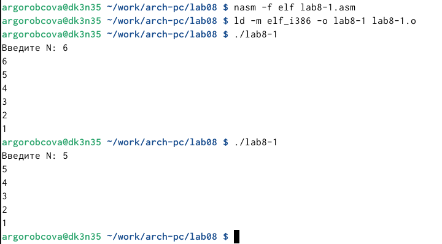{ #fig:002 width=70%, height=70% }

Данный пример показывает, что использование регистра ecx в теле цилка loop может привести к некорректной работе программы (рис. [-@fig:003]). Изменяем текст программы добавив изменение значение регистра ecx в цикле:
Создаем исполняемый файл и проверяем его работу (рис. [-@fig:004]). Какие значения принимает регистр ecx в цикле? 
Соответствует ли число проходов цикла значению N, введенному с клавиатуры?

Программа запускает бесконечный цикл при нечетном N и выводит только нечетные числа при четном N.

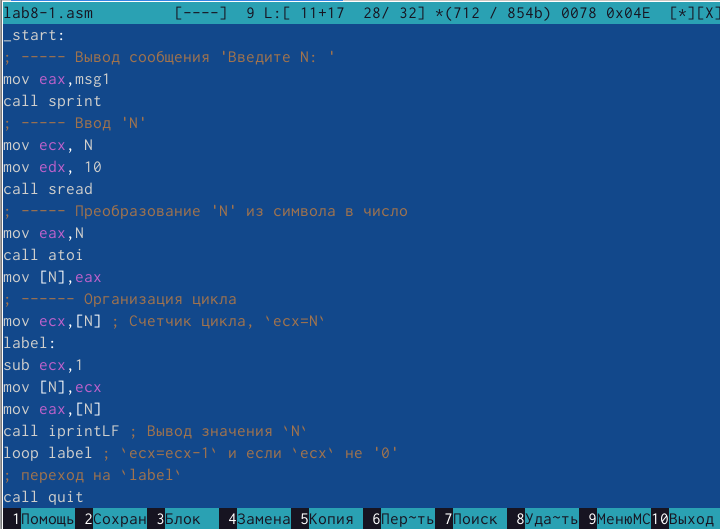{ #fig:003 width=70%, height=70% }

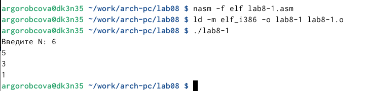{ #fig:004 width=70%, height=70% }

Для использования регистра ecx в цикле и сохранения корректности работы
программы можно использовать стек. Вносим изменения в текст программы
добавив команды push и pop (добавления в стек и извлечения из стека) для
сохранения значения счетчика цикла loop. (рис. [-@fig:005]).Создаем исполняемый файл и проверяем его работу. (рис. [-@fig:006]).
Соответствует ли в данном случае число проходов цикла значению N введенному с клавиатуры?

Программа выводит числа от N-1 до 0, число проходов цикла соответсвует N.

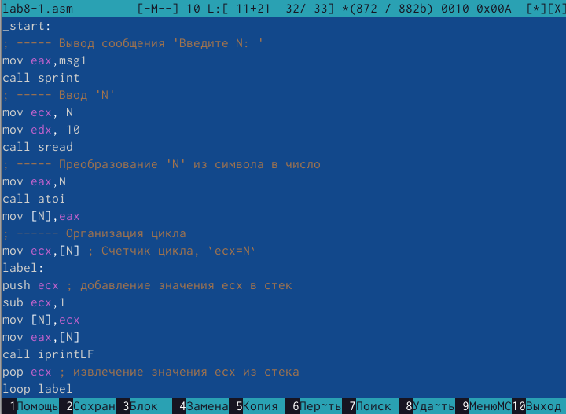{ #fig:005 width=70%, height=70% }

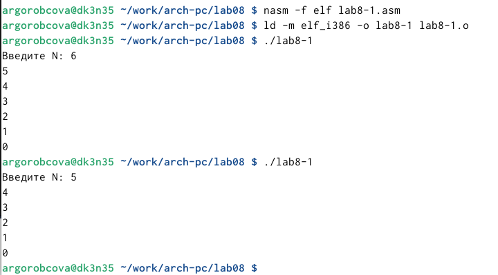{ #fig:006 width=70%, height=70% }

2. Обработка аргументов командной строки

Создаем файл lab8-2.asm в каталоге ~/work/arch-pc/lab08 и вводим в него текст программы из листинга 8.2 (рис. [-@fig:007]).
Создаем исполняемый файл и запускаем его, указав аргументы (рис. [-@fig:008]).
Сколько аргументов было обработано программой?

Программа обработала 5 аргументов.

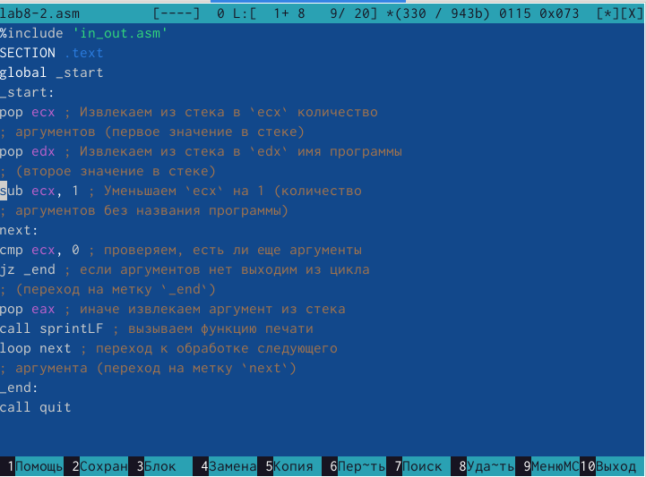{ #fig:007 width=70%, height=70% }

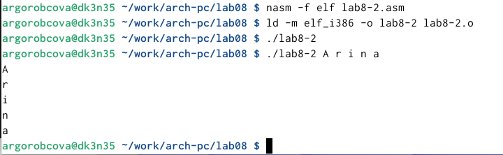{ #fig:008 width=70%, height=70% }

Рассмотрим еще один пример программы которая выводит сумму чисел,
которые передаются в программу как аргументы (рис. [-@fig:009]) и (рис. [-@fig:010]).

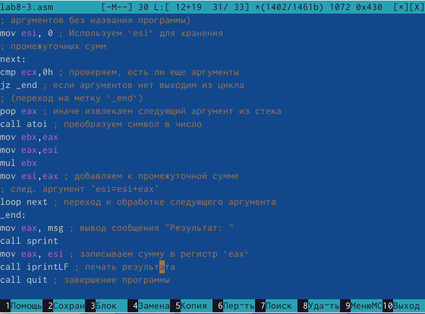{ #fig:009 width=70%, height=70% }

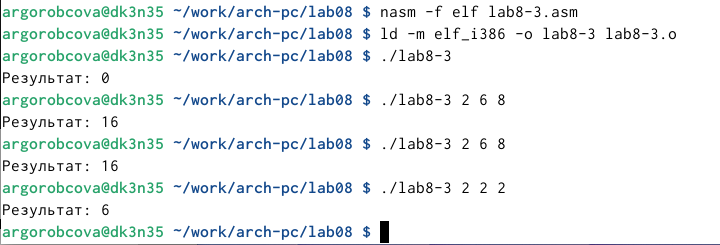{ #fig:010 width=70%, height=70% }

Изменяем текст программы из листинга 8.3 для вычисления произведения
аргументов командной строки (рис. [-@fig:011]) и (рис. [-@fig:012]).

{ #fig:011 width=70%, height=70% }

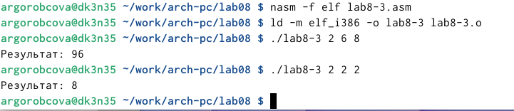{ #fig:012 width=70%, height=70% }

3. Задание для самостоятельной работы

Напишем программу, которая находит сумму значений функции f(x) для x = x1, x2
, ..., xn, т.е. программа должна выводить значение f(x1) + f(x2)+...+f(xn). Значения x передаются как аргументы. Вид функции f(x)
выбрать из таблицы 8.1 вариантов заданий в соответствии с вариантом, 
полученным при выполнении лабораторной работы № 7. (рис. [-@fig:013]).
Создайте исполняемый файл и проверьте его работу на нескольких наборах x. (рис. [-@fig:014]).

для варивнта 20 $f(x) = 3(10 + x)$

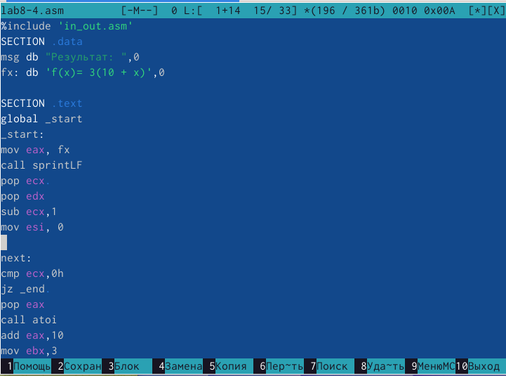{ #fig:013 width=70%, height=70% }

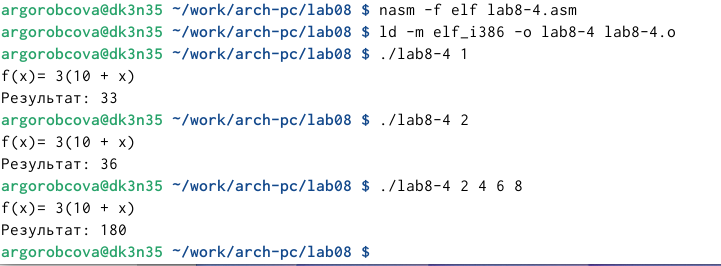{ #fig:014 width=70%, height=70% }

# Выводы

Приобрели навыки написания программ с использованием циклов и обработкой
аргументов командной строки.

