---
## Front matter
title: "Отчёт по лабораторной работе 9"
subtitle: "Дисциплина: Архитектура компьютера"
author: "Горобцова Арина Романовна НММбд-01-24"

## Generic otions
lang: ru-RU
toc-title: "Содержание"

## Bibliography
bibliography: bib/cite.bib
csl: pandoc/csl/gost-r-7-0-5-2008-numeric.csl

## Pdf output format
toc: true # Table of contents
toc-depth: 2
lof: true # List of figures
lot: true # List of tables
fontsize: 12pt
linestretch: 1.5
papersize: a4
documentclass: scrreprt
## I18n polyglossia
polyglossia-lang:
  name: russian
  options:
	- spelling=modern
	- babelshorthands=true
polyglossia-otherlangs:
  name: english
## I18n babel
babel-lang: russian
babel-otherlangs: english
## Fonts
mainfont: IBM Plex Serif
romanfont: IBM Plex Serif
sansfont: IBM Plex Sans
monofont: IBM Plex Mono
mathfont: STIX Two Math
mainfontoptions: Ligatures=Common,Ligatures=TeX,Scale=0.94
romanfontoptions: Ligatures=Common,Ligatures=TeX,Scale=0.94
sansfontoptions: Ligatures=Common,Ligatures=TeX,Scale=MatchLowercase,Scale=0.94
monofontoptions: Scale=MatchLowercase,Scale=0.94,FakeStretch=0.9
mathfontoptions:
## Biblatex
biblatex: true
biblio-style: "gost-numeric"
biblatexoptions:
  - parentracker=true
  - backend=biber
  - hyperref=auto
  - language=auto
  - autolang=other*
  - citestyle=gost-numeric
## Pandoc-crossref LaTeX customization
figureTitle: "Рис."
tableTitle: "Таблица"
listingTitle: "Листинг"
lofTitle: "Список иллюстраций"
lotTitle: "Список таблиц"
lolTitle: "Листинги"
## Misc options
indent: true
header-includes:
  - \usepackage{indentfirst}
  - \usepackage{float} # keep figures where there are in the text
  - \floatplacement{figure}{H} # keep figures where there are in the text
---

# Цель работы

Целью работы является приобретение навыков написания программ с использованием подпрограмм.
Знакомство с методами отладки при помощи GDB и его основными возможностями.

# Выполнение лабораторной работы

1. Создаем каталог для выполнения лабораторной работы № 9, переходим
в него и создаем файл lab9-1.asm.

2. В качестве примера рассмотрим программу вычисления арифметического
выражения $f(x) = 2x+7$ с помощью подпрограммы calcul. В данном
примере $x$ вводится с клавиатуры, а само выражение вычисляется в подпрограмме. (рис. [-@fig:001]) , (рис. [-@fig:002])

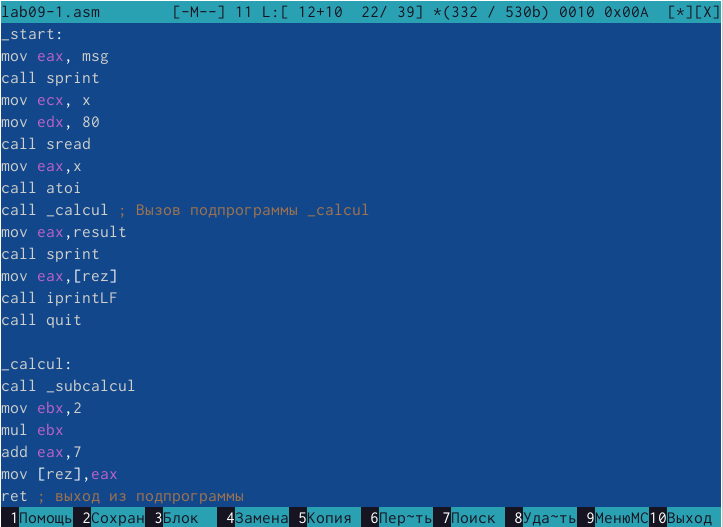{ #fig:001 width=70%, height=70% }

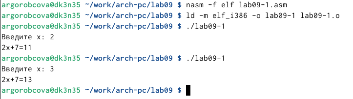{ #fig:002 width=70%, height=70% }

3. Изменяем текст программы, добавляем подпрограмму subcalcul в подпрограмму calcul, 
для вычисления выражения $f(g(x))$, где $x$ вводится с клавиатуры, 
$f(x) = 2x + 7, g(x) = 3x − 1$. (рис. [-@fig:003]), (рис. [-@fig:004])

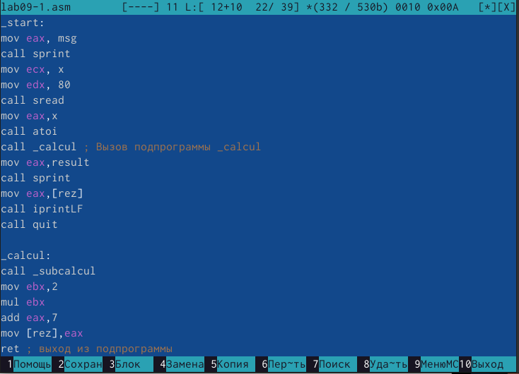{ #fig:003 width=70%, height=70% }

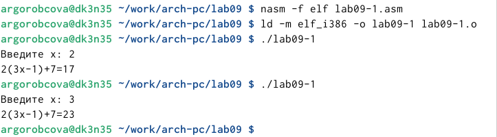{ #fig:004 width=70%, height=70% }

4. Создаем файл lab9-2.asm с текстом программы из Листинга 9.2. (Программа печати сообщения Hello world!). (рис. [-@fig:005])

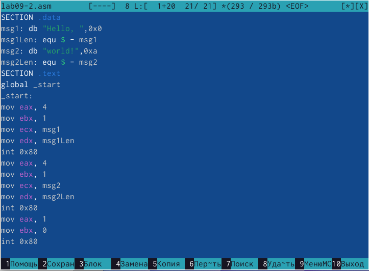{ #fig:005 width=70%, height=70% }

Получаем исполняемый файл. Для работы с GDB в исполняемый файл необходимо 
добавить отладочную информацию, для этого трансляцию программ необходимо проводить с ключом ‘-g’.

Загружаем исполняемый файл в отладчик gdb.
Проверяем работу программы, запустив ее в оболочке GDB с помощью команды run 
(сокращённо r). (рис. [-@fig:006])

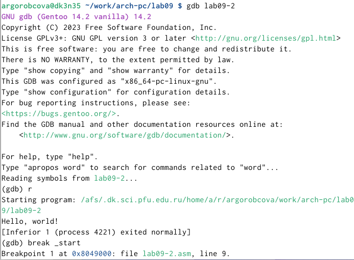{ #fig:006 width=70%, height=70% }

Для более подробного анализа программы установите брейкпоинт на метку
start, с которой начинается выполнение любой ассемблерной программы, и запускаем её.
Посмотрим дизассемблированный код программы. (рис. [-@fig:007]), (рис. [-@fig:008])

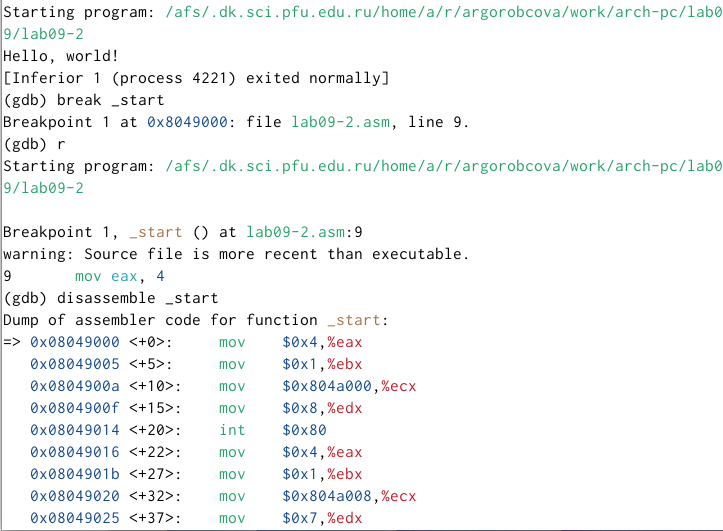{ #fig:007 width=70%, height=70% }

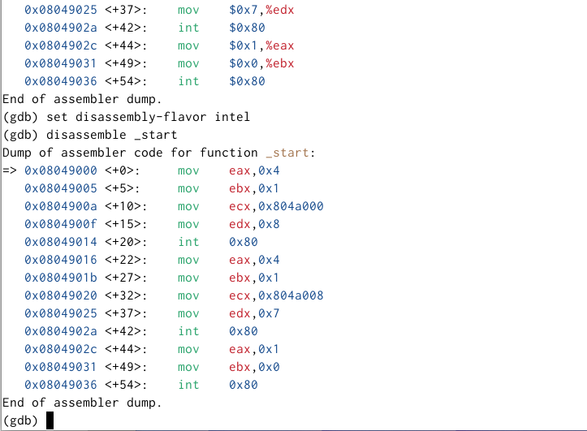{ #fig:008 width=70%, height=70% }

На предыдущих шагах была установлена точка остановки по имени метки (_start). 
Проверяем это с помощью команды info breakpoints (кратко i b).
Установливаем еще одну точку остановки по адресу инструкции. 
Адрес инструкции можно увидеть в средней части экрана в левом столбце соответствующей
инструкции. Определяем адрес предпоследней инструкции (mov ebx,0x0) и установливаем точку. (рис. [-@fig:009])

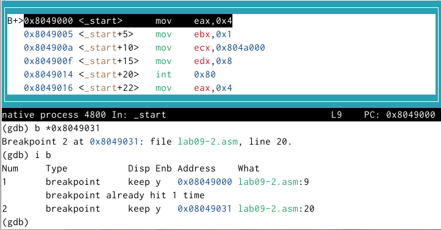{ #fig:009 width=70%, height=70% }

Отладчик может показывать содержимое ячеек памяти и регистров, а при
необходимости позволяет вручную изменять значения регистров и переменных.
Выполняем 5 инструкций с помощью команды stepi (или si) и смотрим за
изменением значений регистров. (рис. [-@fig:010]), (рис. [-@fig:011])

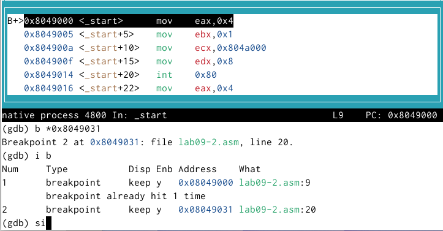{ #fig:010 width=70%, height=70% }

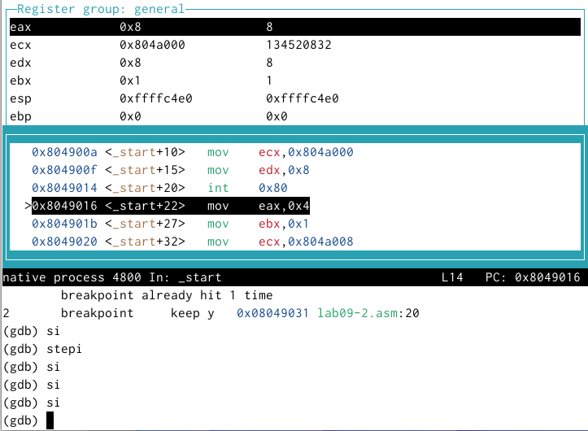{ #fig:011 width=70%, height=70% }

Посмотрели значение переменной msg1 по имени.
Посмотрели значение переменной msg2 по адресу.

Изменили значение для регистра или ячейки памяти можно с помощью команды set, 
задав ей в качестве аргумента имя регистра или адрес. 
Изменили первый символ переменной msg1.(рис. [-@fig:012])

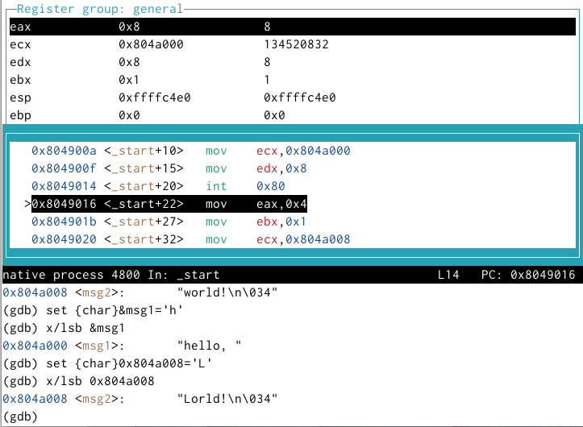{ #fig:012 width=70%, height=70% }

Вывели в различных форматах (в шестнадцатеричном формате, в двоичном формате и в символьном виде) 
значение регистра edx. (рис. [-@fig:013])

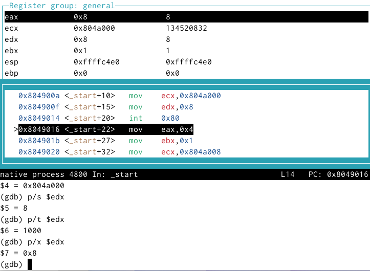{ #fig:013 width=70%, height=70% }

С помощью команды set изменили значение регистра ebx (рис. [-@fig:014])

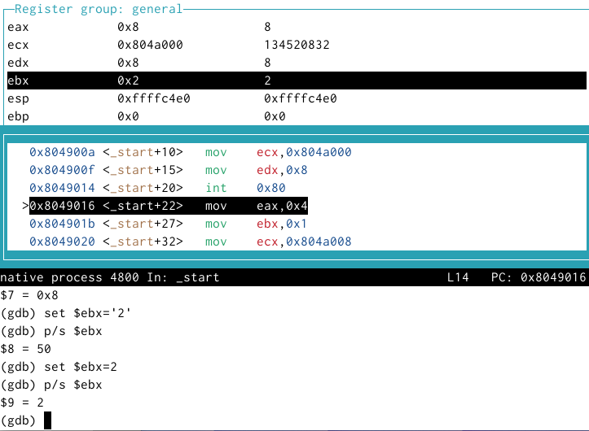{ #fig:014 width=70%, height=70% }

5. Скопировали файл lab8-2.asm, созданный при выполнении лабораторной работы №8, 
с программой выводящей на экран аргументы командной строки. Создали исполняемый файл.
Для загрузки в gdb программы с аргументами необходимо использовать ключ
--args. Загрузили исполняемый файл в отладчик, указав аргументы.

Для начала установили точку останова перед первой инструкцией в программе и запустили ее.

Адрес вершины стека храниться в регистре esp и по этому адресу располагается число равное количеству 
аргументов командной строки (включая имя программы).
Как видно, число аргументов равно 5 – это имя программы lab9-3 и 
непосредственно аргументы: аргумент1, аргумент, 2 и 'аргумент 3'.

Посмотрели остальные позиции стека – по адесу [esp+4] располагается адрес
в памяти где находиться имя программы, по адесу [esp+8] храниться адрес
первого аргумента, по аресу [esp+12] – второго и т.д. (рис. [-@fig:015])

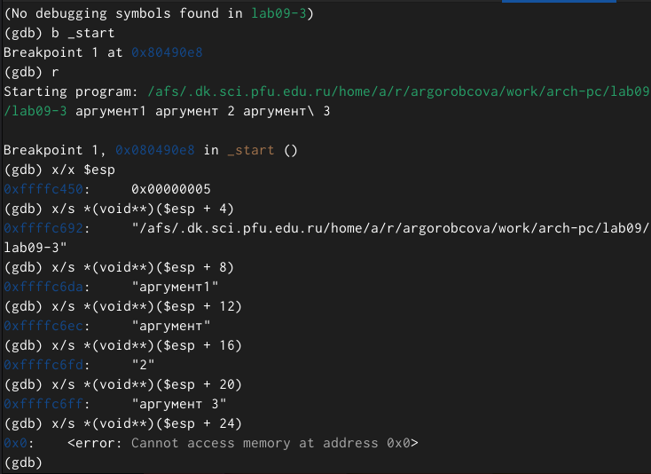{ #fig:015 width=70%, height=70% }

Объясняем, почему шаг изменения адреса равен 4 ([esp+4], [esp+8], [esp+12] - потому что шаг равен размеру переменной - 4 байтам.

6. Преобразовали программу из лабораторной работы №8 (Задание №1 для
самостоятельной работы), реализовав вычисление значения функции f(x)
как подпрограмму. (рис. [-@fig:016]), (рис. [-@fig:017])

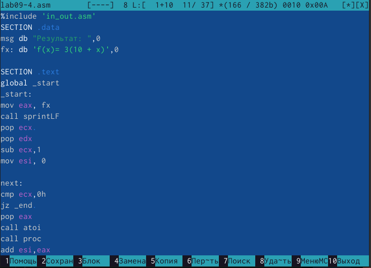{ #fig:016 width=70%, height=70% }

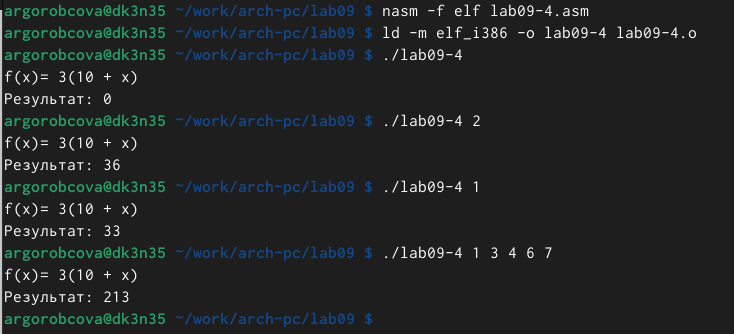{ #fig:017 width=70%, height=70% }

7. В листинге приведена программа вычисления выражения $(3+2)*4+5$.
При запуске данная программа дает неверный результат. Проверили это.
С помощью отладчика GDB, анализируя изменения значений регистров,
определяем ошибку и исправляем ее. (рис. [-@fig:018])

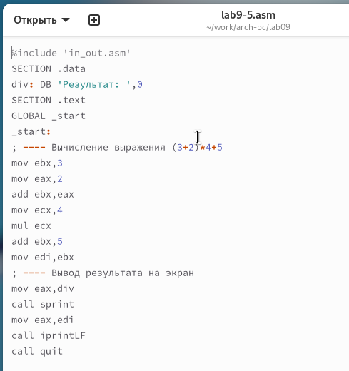{ #fig:018 width=70%, height=70% }

Заметим, что перепутан порядок аргументов у инструкции add и что по окончании работы в edi отправляется ebx вместо eax

Исправленный код программы (рис. [-@fig:019])

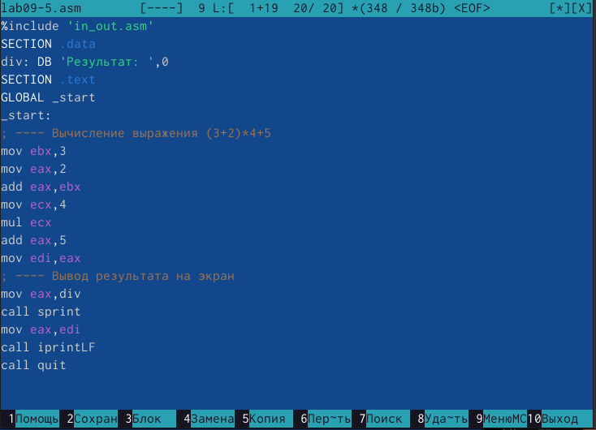{ #fig:020 width=70%, height=70% }

# Выводы

Освоили работy с подпрограммами и отладчиком.
