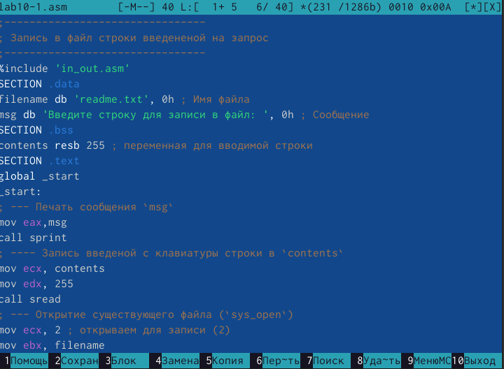
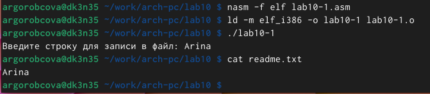
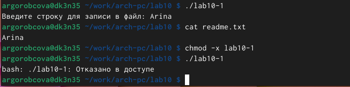
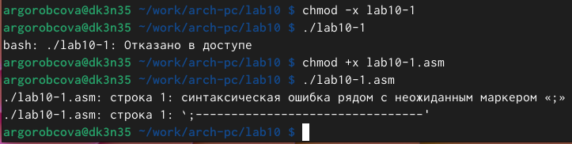
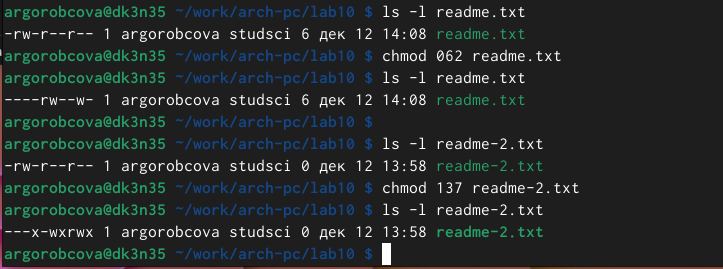
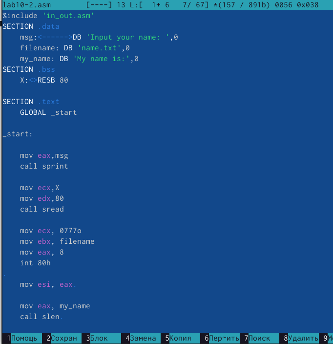
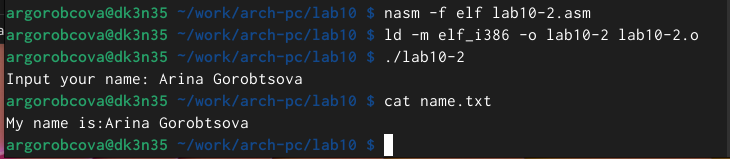

---
## Front matter
title: "Отчёт по лабораторной работе 10"
subtitle: "Дисциплина: Архитектура компьютера"
author: "Горобцова Арина Романовна НММбд-01-24"

## Generic otions
lang: ru-RU
toc-title: "Содержание"

## Bibliography
bibliography: bib/cite.bib
csl: pandoc/csl/gost-r-7-0-5-2008-numeric.csl

## Pdf output format
toc: true # Table of contents
toc-depth: 2
lof: true # List of figures
lot: true # List of tables
fontsize: 12pt
linestretch: 1.5
papersize: a4
documentclass: scrreprt
## I18n polyglossia
polyglossia-lang:
  name: russian
  options:
	- spelling=modern
	- babelshorthands=true
polyglossia-otherlangs:
  name: english
## I18n babel
babel-lang: russian
babel-otherlangs: english
## Fonts
mainfont: IBM Plex Serif
romanfont: IBM Plex Serif
sansfont: IBM Plex Sans
monofont: IBM Plex Mono
mathfont: STIX Two Math
mainfontoptions: Ligatures=Common,Ligatures=TeX,Scale=0.94
romanfontoptions: Ligatures=Common,Ligatures=TeX,Scale=0.94
sansfontoptions: Ligatures=Common,Ligatures=TeX,Scale=MatchLowercase,Scale=0.94
monofontoptions: Scale=MatchLowercase,Scale=0.94,FakeStretch=0.9
mathfontoptions:
## Biblatex
biblatex: true
biblio-style: "gost-numeric"
biblatexoptions:
  - parentracker=true
  - backend=biber
  - hyperref=auto
  - language=auto
  - autolang=other*
  - citestyle=gost-numeric
## Pandoc-crossref LaTeX customization
figureTitle: "Рис."
tableTitle: "Таблица"
listingTitle: "Листинг"
lofTitle: "Список иллюстраций"
lotTitle: "Список таблиц"
lolTitle: "Листинги"
## Misc options
indent: true
header-includes:
  - \usepackage{indentfirst}
  - \usepackage{float} # keep figures where there are in the text
  - \floatplacement{figure}{H} # keep figures where there are in the text
---

# Цель работы

Целью работы является приобретение навыков написания программ для работы с файлами.

# Выполнение лабораторной работы

1. Создали каталог для программам лабораторной работы № 10, перешли
в него и создали файлы lab10-1.asm, readme-1.txt и readme-2.txt

2. Написали в файл lab10-1.asm текст программы из листинга 10.1 (Программа
записи в файл сообщения). Создали исполняемый файл и проверили его работу.

{ #fig:001 width=70%, height=70% }

{ #fig:002 width=70%, height=70% }

3. С помощью команды chmod изменили права доступа к исполняемому файлу
lab10-1, запретив его выполнение. Попытались выполнить файл. 
Файл не запускается, поскольку запуск запрещен, снят атрибут х.

{ #fig:003 width=70%, height=70% }

4. С помощью команды chmod изменили права доступа к файлу lab10-1.asm с
исходным текстом программы, добавили права на исполнение. Попытались
выполнить его.
Файл запускается и терминал пытается выполнить его содержимое как консольные команды.
Но инструкции ассемблера не являются командами терминала, поэтому появляются ошибки.
Тем не менее, если в такой файл написать команды терминала, то можно будет их выполнить путем запуска файла.

{ #fig:004 width=70%, height=70% }

5. Предоставили права доступа к файлам readme в соответствии с вариантом в таблице 10.4. 
Проверили правильность выполнения с помощью команды ls -l.

для варианта 20: ```--- rw- -w-``` и ```001 011 111```

{ #fig:005 width=70%, height=70% }

6. Написали программу работающую по следующему алгоритму:

* Вывод приглашения “Как Вас зовут?”

* ввести с клавиатуры свои фамилию и имя

* создать файл с именем name.txt

* записать в файл сообщение “Меня зовут”

* дописать в файл строку введенную с клавиатуры

* закрыть файл

{ #fig:006 width=70%, height=70% }

{ #fig:007 width=70%, height=70% }

# Выводы

Освоили работy с файлами и правами доступа.
